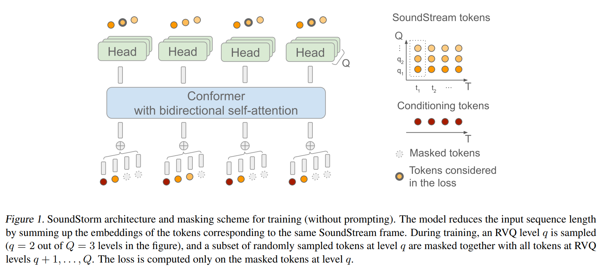

# SoundStorm: Efficient Parallel Audio Generation 

**Work In Progress ...**

SoundStorm is a model for efficient, non-autoregressive audio generation. SoundStorm receives as input the semantic tokens of
AudioLM, and relies on bidirectional attention and confidence-based parallel decoding to generate the tokens of a neural audio codec.



## Pre-processing and Training Scripts:

### DataSet :

Pre-processing and Data format follows this: https://huggingface.co/datasets/collabora/whisperspeech


### Start Training:
```
python train.py
```
**Semantic token path:** `./data/whisperspeech/whisperspeech/librilight/stoks/`

**Acoustic token path:** `./data/whisperspeech/whisperspeech/librilight/encodec-6kbps/`


## References :

* MAskGIT code : https://github.com/dome272/MaskGIT-pytorch
* SoundStorm : https://github.com/feng-yufei/shared_debugging_code

